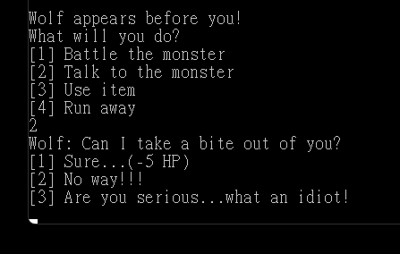

# Patricia Quest
## Project Description
A SUD (Single User Dungeon) game named Patricia Quest (__named by Mo!__). In this game you play as an up-and-coming hero
who has set off to save the small town of Moland from their predestined demise. Get some tea ready, because with 10 
randomized maps, lots of equipment, and over 15 unique enemies to encounter, prepare to dive right in to the fray.
This game boasts a complex battle system where you can both fight or talk your way to the end of the game! 
Make different builds and try to beat the game in different ways. Yes you can beat the game entirely by talking! 
Have fun hero!

## Contributors

Name: Chun Wei Mo

Student Number: A01375071

GitHub Username: ChunWeiMo

--------------------------

Name: Patricia Lo

Student Number: A00959925

GitHub Username: pkwlo

# Menu
1. [Game Guide](#game-guide)
   1. [How to Play](#how-to-play)
   2. [Character](#character)
   3. [Enemies](#enemies)
   4. [Maps](#maps)
2. [Sample Code](#sample-code-for-mandatory-python-elements)

# Game Guide
A detailed guide for the game! Basic tutorial and info on every enemy and map in the game. 

## How to play

1. Open the game
   * New Game
     * Create a character
        > 
     * Slot attribute points
        >  
   * Continue your adventure
        > 

   2. Exploration
    >    
  
      * Command
     
          * Map
            >    You can only see what in your *vision range*
          * Current location: 
            >    You are at X: 6, Y: 1. 
          * Command list:
            >    N / E / S / W
               * Move in the directions North, East, South, West
            >    
            
            >    SAVE / LOAD
               * Save or Load your play data
            >    STATS
               * Show character states, equipment, item etc.:
            >    Q
               * Quit game
      * Map icon
        >    \#
           * Character
        >    D
           * Door: you can move to the next random map
        >    E
           * Enemy: regular enemies
        >    B
           * Mini boss: special enemy with ability
        >    C
           * Equipment Chest: you can get one equipment
        >    M
           * Merchant: you can buy potion from their
        >    H
           * Healing fountain: you can heal HP here
        >    F
           * Final boss: Evil Dragon
        >    \-\-\-\-\-
           * North / south wall
        >    |||
           * East / west wall
3. Battle
> Battle the monster
* start a fight

> Talk to the monster
* can get more award

> Use item
* heal some hp
  
> Run away
* escape the fight
  
### ...More content awaits your exploration!

## Character
> Attribute

* HP (Health points) - If HP reaches 0, you die and the game is over.
* STR (Strength) - Deal more damage to the enemy.
* DEF (Defense) - Defense against enemy damage.
* CHR (Charisma) - Avoid battles by talking to monsters.
* SPD (Speed) - Allows you to act more often in battle.
* LUK (Luck) - Affects lucky map spawn chance and battle escape chance.
* VIS (Vision) - How far into the distance you can see.
>Level 1
- HP: 100
- Starting stats are 1 in each attribute
- 10 attribute points to allocate at the beginning of the game
>Level 2
- HP: 120
- 5 attribute points to allocate when reaching level 2
>Level 3
- HP: 150
- 5 attribute points to allocate when reaching level 3

## Enemies
>Level 1

|         | **Slime** | **Pixie** | **Wolf** | **Skeleton** | **Ghost** | **Golem** |
|---------|-----------|-----------|----------|--------------|-----------|-----------|
| **HP**  | 10        | 6         | 15       | 15           | 10        | 20        |
| **STR** | 2         | 2         | 3        | 2            | 2         | 1         |
| **DEF** | 1         | 1         | 1        | 2            | 0         | 5         | 
| **SPD** | 2         | 3         | 2        | 2            | 4         | 0         |

>Level 2

|         | **Cave Spider** | **Skeleton Archer** | **Restless Spirit** | **Succubus** | **Dungeon Maid** | **Gargoyle** |
|---------|-----------------|---------------------|---------------------|--------------|------------------|--------------|
| **HP**  | 25              | 20                  | 30                  | 20           | 25               | 40           |
| **STR** | 1               | 4                   | 4                   | 3            | 3                | 2            |
| **DEF** | 2               | 0                   | 1                   | 1            | 3                | 6            |
| **SPD** | 5               | 4                   | 3                   | 4            | 2                | 0            |

>Level 2 Mini Boss

|         | **Cerberus** | **Oberon** | **Dracula** |
|---------|--------------|------------|-------------|
| **HP**  | 50           | 40         | 40          |
| **STR** | 5            | 4          | 5           |
| **DEF** | 5            | 0          | 1           |
| **SPD** | 0            | 6          | 4           |

### Special Skills
1. Cerberus: Attacks 3 times in a row.
2. Oberon: Summons a High Pixie to heal his wounds every 3 turns.
3. Dracula: Each turn, cures his own HP equal to the amount of damage dealt to the player.
>Level 3 Final Boss

|         | **Evil Dragon** |
|---------|-----------------|
| **HP**  | 100             |
| **STR** | 7               |
| **DEF** | 4               |
| **SPD** | 3               |

### Skills
1. Fireball: Deals 2 extra damage and burns the player for 3 turns (Burn DOT: 5 HP per turn).
2. Tail Whip: Deals 2 extra damage and has a 30% chance to stun the player for 1 turn.
3. Claw Attack: Deals raw damage. Damage from this attack ignores player defense.

## Maps

## Sample Code for Mandatory Python Elements

1. use of immutable data structures like tuples to minimize unnecessary mutability
    > tuple: map.py line 20 -> "Door": [(8, 0), (0, 4), (6, 9)]
    
    > tuple: equipment.py line 14 -> ["Steel sword", ("STR", 3)]
2. use of mutable data structures like lists and dictionaries in a thoughtful and correct manner,
   > list: map.py line 257 -> element_list = ["Door", "Enemy", "Chest", "Merchant",
                    "Healing_fountain", "Boss", "Final Boss", "Oberon", "Cerberus", "Dracula"]
   
   > dictionary: character.py line 16 -> character_stats = {"Level": 1, "HP": 100, "STR": 1,
                       "DEF": 1, "CHR": 1, "SPD": 1, "LUK": 1, "VIS": 3}
3. thoughtful use of exceptions and exception handling that prevents the program from crashing
    > battle.py line 427 -> try ... except ValueError

    > game.py line 67 -> try ... except TypeError
4. minimized scope and lifetime of all variables and objects
5. decomposition of your idea into a collection of small, atomic, independent, and reusable functions
6. simple flat code that is easy to understand
7. demonstration of an understanding of how comprehensions work through the meaningful and
correct use of one or more list/dictionary comprehensions
    > battle.py line 474 -> [
            cerberus_turn(character_dictionary, enemy_appeared)
            for _ in itertools.repeat(None, 3)
        ]

    > dictionary comprehension: map.py line 254 -> current_map = {(column, row): "Empty" for row in range(rows) for column in range(columns)}
1. selection using if-statements
    > movement.py line 112 -> if direction == "N":
        character_dictionary["Y-coordinate"] -= 1
        print("moving toward North...")
    
    > talk.py line 28 -> if enemy_appeared["Name"] == "Slime":
        specific_enemy_lines = enemy_lines_dictionary["Level 1"][0]
2. repetition using the for-loop and/or the while loop where it makes sense but not excessively
    > game.py line 43 -> while character_dictionary["Character_status"]["HP"] > 0 and not achieved_goal and command.upper != "Q":

    > map.py line 259 for element in element_list:
        set_element_on_map(map_elements, element, current_map)
3.  use of the membership operator where it makes sense
    > equipment.py line 81 -> if equipment_number in equipments:
            equipment = equipments[equipment_number]
            break
4.  appropriate use of the the range function
    > vision.py line 79 -> for row in range(-character["Character_status"]["VIS"], character["Character_status"]["VIS"]+1)
5.  thoughtful and meaningful use of one or more functions from itertools
    > battle.py line 474 -> [
            cerberus_turn(character_dictionary, enemy_appeared)
            for _ in itertools.repeat(None, 3)
        ]
6.  the random module
    > map.py line 140 ->  map_elements = map_list[random.randint(1, 10)]
7.  function annotations
    > every function

    > story_line.py line 4-> def get_story(character_dictionary: dict) -> dict

    > map.py line 125 -> def select_map(character_dictionary: dict, map_list: dict) -> dict
8.  doctests and/or unit tests for every single function
    > unit_test folder: 225 tests in total
9.  ALL output must be formatted using f-strings and/or str.format and/or %-formatting where applicable.

## Technologies and Resources Used
- Python 3.11.5
- Python.org
- Stack Overflow
- COMP 1510 Notes